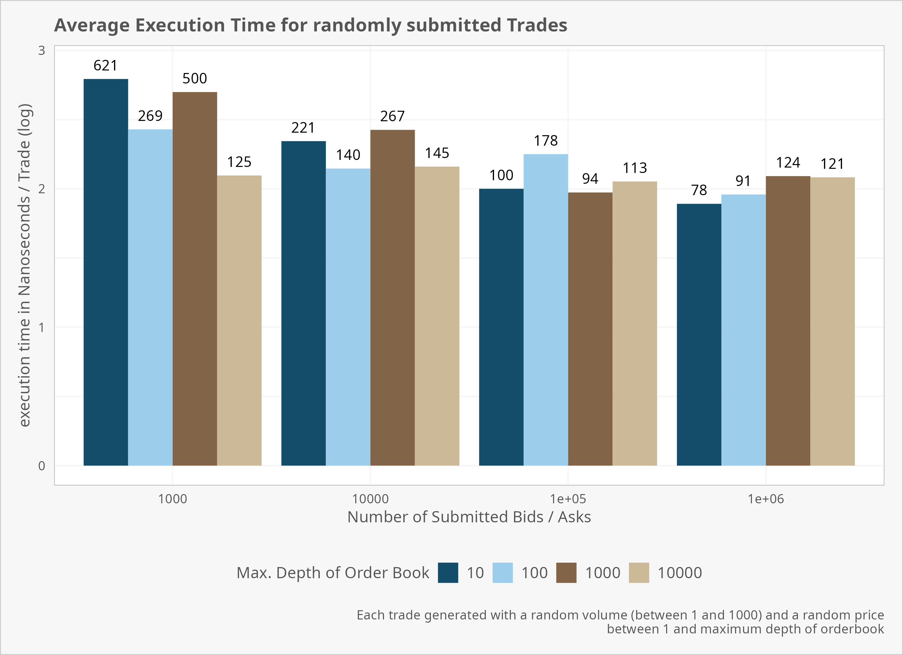

# Matching Engine
This project implements a simple matchig engine with price/time priority of orders. It currently supports only limit and market orders but can easily be extended to support more order types. 

The engine supports order books for multiple instruments and allows for the following actions with the following asymptotic runtimes
<br>
    <table align="center">
        <tr>
            <td>Operation</td>
            <td align="center">Time Complexity</td>
        </tr>
        <tr>
            <td>insert</td>
            <td align="center">log(N) (first insertion of price level), O(1) else</td>
        </tr>
        <tr>
            <td>delete</td>
            <td align="center">O(1)</td>
        </tr>
        <tr>
            <td>execute</td>
            <td align="center">O(1)</td>
        </tr>
        <tr>
            <td>modify</td>
            <td align="center">O(1)</td>
        </tr>
    </table>
<br>
To guarantee constant execution time for all operations, the engine uses the following data structures: 

<ul>
<li>The matching engine manages a hash map which maps the name of each instrument to a specifc order book instance</li>
<li>each order book manages two red black binary tree (one for bids, one for asks) which store ticks (price levels) in ascending order.</li>
<li>To quickly retreive a price level that has already been inserted into the tree in O(1), the orderbook also manages a hashtable that matches each price level to a node in the tree.
This allows to access each element in the tree in O(1) once inserted.</li>
<li>the custom implementation of the RB-Tree stores references to the minimum and maximum tick values which allows for retreival of the best bid / ask in O(1)</li>
<li>Each tick stores orders in a doubly linked list which allows to insert, delete and remove elements in O(1)</li>
</ul>

## Setup
First, create an instance of MatchingEngine and TradeLogger. 
TradeLogger is responsible for logging the trading results in a separate thread. The current implementation is rather primitive. If a trade is flagged for logging, the trade logger will simply 
write the trade result to a file specified in the constructor of the tradeLogger. 
Once created, supply the matching engine with the trade logger instance.
```java
MatchingEngine matcher = new MatchingEngine();
TradeLogger tl = new TradeLogger("logFile.txt");
matcher.addTradeLoger(tl);
```

## add trades 
The engine currently allows for the addition of limit and market orders.
To add an order, create an instance of an order and pass it to the matching engine for execution. 

Make sure that each trade in the same instrument has a unique orderID 
```java
Order o1 = new LimitOrder("Amazon", 1, 100, 100, OrderType. SELL, true);
Order o2 = new LimitOrder("Amazon", 2, 100, OrderType.BUY, true);
matcher.add(o1);
matcher.add(o2);
```

## modify trades 
To modify a trade, pass an instance of the original trade as well as a new instance with the modified parameters (but same OrderID, Direction, Instrument)
Currently, a modification is equal to deleting the original trade and inserting a new trade, which means that the place in the queue of the original trade 
will be lost and the modified trade will be added to the end of the queue
```java
Order originalOrder = new LimitOrder("Amazon", 1, 100, 100, OrderType. SELL, true);
matcher.addOrder(originalOrder);

// increase quantity
Order modifiedOrder = new LimitOrder("Amazon", 1, 200, 100, OrderType. SELL, true); 
matcher.modifyOrder(originalOrder, modifiedOrder);
```

## delete trades 
```java
Order order = new LimitOrder("Amazon", 1, 100, 100, OrderType. SELL, true);
matcher.addOrder(order);
matcher.deleteOrder(order);
```

## Performance statistics 
### Order Insertion 
The below plot depicts execution time for adding orders to the orderbook where 
N Buy and N Sell limit orders were submitted with random volumes / prices whereby volumes are between [0, 1000) and 
prices are between [0, max_depth_per_side) for bids and [max_depth_per_side, 2*max_depth_per_side) for the ask side to ensure 
that all orders are added to the book without any executions 


Order insertion generally takes longer the more different prices exist in the system. 
This is because the original insertion of a price takes O(logN) as the prices is added to a binary tree. Once a price has been inserted, 
additional trades can be added to the price by retreiving the price instance from a hashtable in constant time.

### Inserting & Executing orders

Inserting orders where prices are allowed to cross such that execution takes place increases average execution time per order but yields more balanced 
execution time between different maximum book depth configurations



The engine is currently configured such that any price will be removed from the book once it has no more trades attached. If more information about the orderbook is known 
(eg. the prices are very likely to fluctuate within a certain range), all prices can be instantiated beforehand, such that all operations on the orderbook will be 
executed in O(1) as no more prices need to be added to the binary tree. 

As expected, this yields virtually equal execution time across all diffferent price depth configurations. 


## Possible Improvements 
- If the structure of the orderbook is known better, the binary trees could be replaced with arrays where each address represents one price level which could increase performance as orders with similar 
prices are more likely to be cached together. 

- Currently, if a there is no more volume at a specific price in the book, that price is deleted from the tree, which increases execution time if a new trade is entered at the same price, as the price has to be
inserted into the binary tree again. If more about the book structure is known, automatic deletion of prices with no more volume could be avoided or deferred. 

- Logging the trades currently slows down the system by a lot. By using a non-blocking queue and a different thread to write data, this bottleneck could be removed
